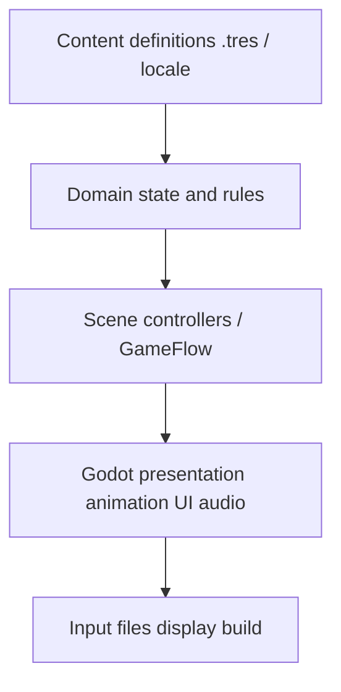

<!-- PRESERVATION RULE: Never delete or replace content. Append or annotate only. -->

# Architecture (agent index)

This is the agent-facing map. Runtime law is [TECHNICAL_ARCHITECTURE.md](TECHNICAL_ARCHITECTURE.md). Camera/fold law is [decisions/0002-camera-and-facet-model.md](decisions/0002-camera-and-facet-model.md). Content identity and saves: [decisions/0003-content-identity-and-saves.md](decisions/0003-content-identity-and-saves.md). Engine pin: [decisions/0001-engine-and-language.md](decisions/0001-engine-and-language.md).

## Repository

```text
root
|- AGENTS.md          contract, including /caveman ultra first
|- README.md          user-facing entry
|- CHANGELOG.md       demonstrated Unreleased work
|- map_maker.bat      internal zone dress tool; title also offers Open Map Maker
|- docs/              product + agent status
`- game/              Godot 4.7.2 project
```

## Runtime layers



Dependencies point down. Domain code does not look up nodes, play audio, or write files.

## Allowed autoloads

`GameFlow`, `ContentDB`, `InputRouter`. Declared but not yet required as live autoloads: `SaveService`, `AudioDirector`, `EventBus`. Adding another autoload needs an ADR. Title loop and UI clicks are scene-owned on `TitleShellAudio` in `app.tscn`.

## World rule

The world never rotates. Camera yaw changes. `FacetController` commits authored facets. M1 implements Peek only. M2 owns committed World Turns.

## Current playable composition

- App shell: title, tabbed settings (Video / Accessibility / Controls), walking-diorama entry, metrics debug entry
- Zone: `zone.brindlewick_square` with geometry, gameplay, and presentation layers
- Dress: crate, lamp, planter, trees, nature pieces, and graybox buildings instanced by `PlacementLayer` from a zone placement list; map maker also writes dirt-road patch centers, with ghost/hover overlays in the tool
- Surfaces: independent grass and dirt-road scenes plus materials/shaders
- Trees: `TreeDefinition` species and a zone-owned `TreeGroveLayout`, built by `TreeGrove3D` as hero `TreeBody3D` bodies plus per-species MultiMesh belts
- Nature: `NatureAmbience` under the presentation layer owns `AmbientBirdFlock`, `LeafFallEmitter`, and `FootfallMotes`. One baseline bird body serves every `BirdSpeciesDefinition`; standalone flocks and leaf drifts anchor on their own node so the map maker's **Nature** family can place them. `ZoneController` injects the player and fans camera-motion settings to the `ambient_motion` group
- Actor: original Mara prototype, eight displayed directions from five authored facings, painted as 21 named body layers flattened by `SpriteLayerCompositor` into one billboarded quad
- Equipment: closed 16-slot `EquipmentSlotCatalog`, immutable `ItemDefinition` content, session-scoped `PartyInventory` owned by the app shell, and a paper-doll screen on the `equipment` action
- Camera: long-lens rig, Peek clamp, recenter, motion modes, foreground fade
- Scout: first-person look from a map pick, presentation-only
- Tests: `game/tests/run_tests.gd` discovers `game/tests/suites/*_tests.gd`; fixtures stay under `game/tests/fixtures/`

See [MILESTONE_STATUS.md](MILESTONE_STATUS.md) for what is demonstrated versus pending.
