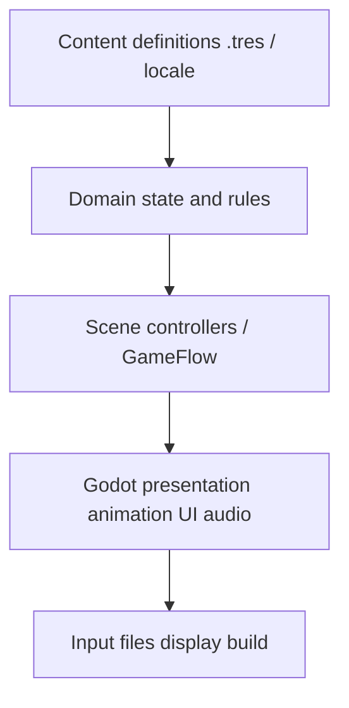

<!-- PRESERVATION RULE: Never delete or replace content. Append or annotate only. -->

# Architecture (agent index)

This is the agent-facing map. Runtime law is [TECHNICAL_ARCHITECTURE.md](TECHNICAL_ARCHITECTURE.md). Camera/fold law is [decisions/0002-camera-and-facet-model.md](decisions/0002-camera-and-facet-model.md). Content identity and saves: [decisions/0003-content-identity-and-saves.md](decisions/0003-content-identity-and-saves.md). Engine pin: [decisions/0001-engine-and-language.md](decisions/0001-engine-and-language.md).

## Repository

```text
root
|- AGENTS.md          contract, including /caveman ultra first
|- README.md          user-facing entry
|- CHANGELOG.md       demonstrated Unreleased work
|- docs/              product + agent status
`- game/              Godot 4.7.2 project
```

## Runtime layers



Dependencies point down. Domain code does not look up nodes, play audio, or write files.

## Allowed autoloads

`GameFlow`, `ContentDB`, `InputRouter`. Declared but not yet required as live autoloads: `SaveService`, `AudioDirector`, `EventBus`. Adding another autoload needs an ADR.

## World rule

The world never rotates. Camera yaw changes. `FacetController` commits authored facets. M1 implements Peek only. M2 owns committed World Turns.

## Current playable composition

- App shell: title, settings, walking-diorama entry, metrics debug entry
- Zone: `zone.brindlewick_square` with geometry, gameplay, and presentation layers
- Surfaces: independent grass and dirt-road scenes plus materials/shaders
- Actor: original Mara prototype, eight displayed directions from five authored facings
- Camera: long-lens rig, Peek clamp, recenter, motion modes, foreground fade

See [MILESTONE_STATUS.md](MILESTONE_STATUS.md) for what is demonstrated versus pending.
